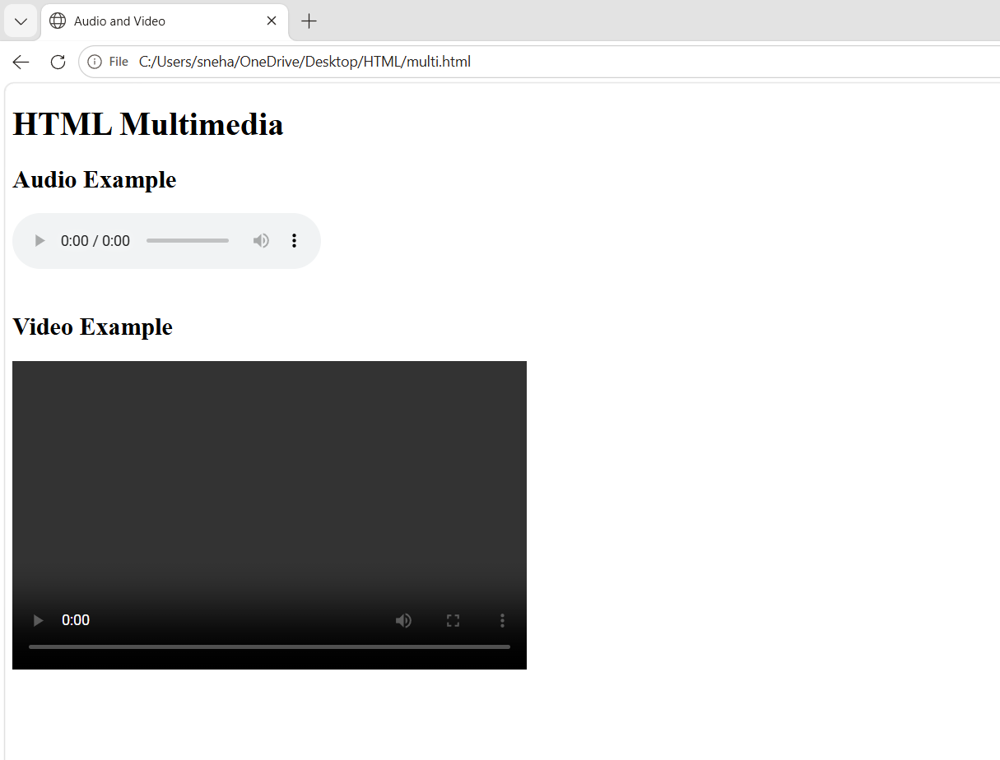
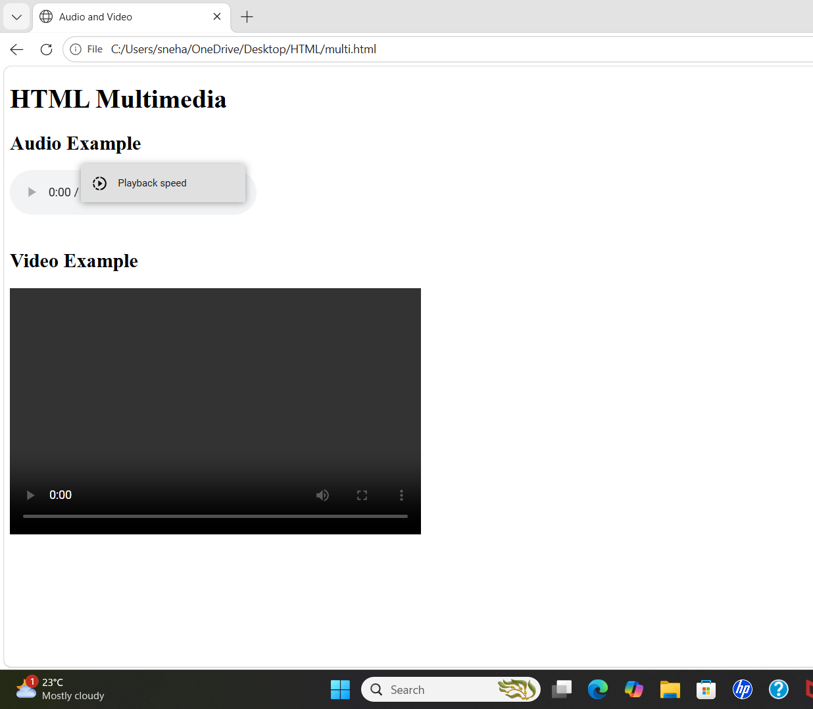

# HTML Multimedia

## Aim
To create a simple HTML page that demonstrates the use of audio and video elements.

## Description
This HTML page uses HTML5 multimedia tags to embed and play an audio file and a video file in the browser.

## Features
- Displays a heading
- Plays an audio file using the `<audio>` tag
- Plays a video file using the `<video>` tag
- Uses built-in playback controls

## Technologies Used
- HTML5

## Files Required
- `index.html`
- `song.mp3`
- `video.mp4`

## Output

## Result
Successfully created an HTML page that plays audio and video using HTML5 multimedia elements.
