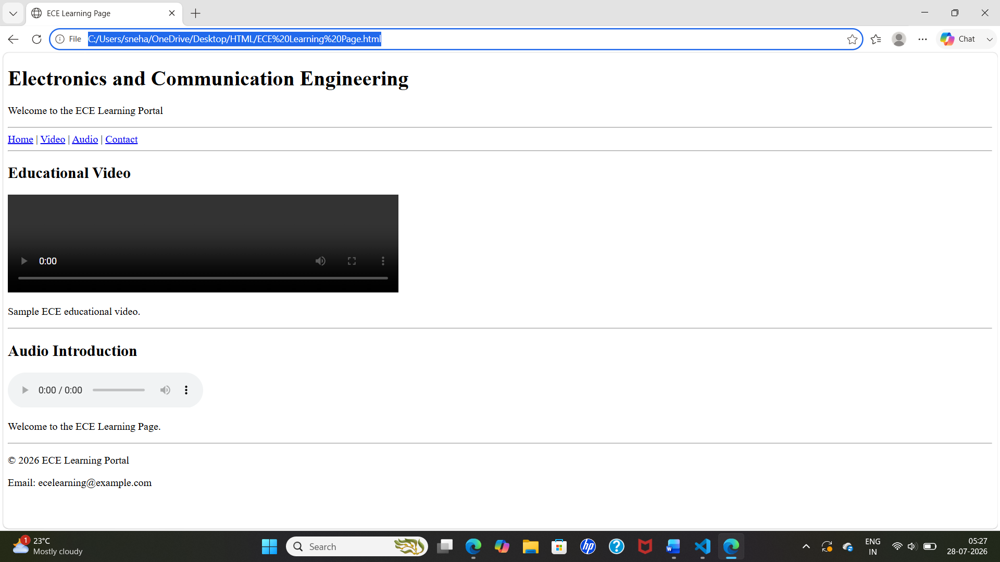

# ECE Learning Page

## Aim
To create an ECE Learning Page using HTML5 multimedia elements.

## Requirements
- Header
- Navigation
- One educational video
- One audio introduction
- Footer

## Technologies Used
- HTML5

## Output

## Result
Successfully created an ECE Learning Page with a header, navigation, educational video, audio introduction, and footer using HTML5.
