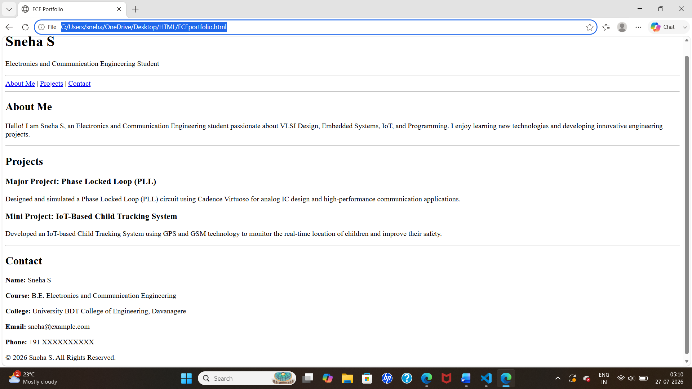

# Semantic HTML - ECE Portfolio Webpage

## Aim
To create a simple ECE Portfolio webpage using HTML5 semantic elements.

## Semantic Elements Used
- `<header>`
- `<nav>`
- `<section>`
- `<article>`
- `<footer>`

## Program Description
This webpage contains:
- Header with portfolio title
- Navigation links
- About Me section
- Projects article
- Contact information in the footer

## Output

## Conclusion
This program demonstrates the use of HTML5 semantic elements to create a well-structured and meaningful ECE portfolio webpage.
