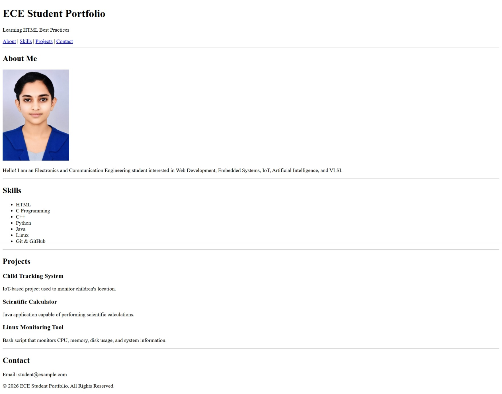

# ECE Student Portfolio

A simple HTML portfolio webpage created by following HTML best practices.

## Features

- Semantic HTML5 elements
- Header, Navigation, Main, Sections, Articles, and Footer
- Image with alt attribute
- HTML comments
- Responsive viewport
- Clean and organized code

## Technologies Used

- HTML5

## Project Structure

```
Day15_Project/
│
├── index.html
├── README.md
├── output.png
└── images/
    └── profile.jpg
```

## Output



## Learning Outcomes

- HTML document structure
- Semantic elements
- Image handling
- Comments in HTML
- Organizing project folders
- HTML best practices

---

**Created by:** Sneha
