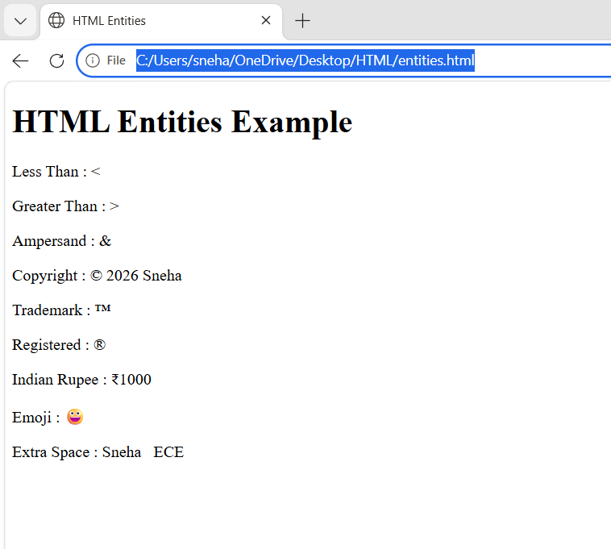

# HTML Entities Example

This HTML example demonstrates the use of common HTML entities.

## Entities Used

- Less Than (`&lt;`)
- Greater Than (`&gt;`)
- Ampersand (`&amp;`)
- Copyright (`&copy;`)
- Trademark (`&trade;`)
- Registered (`&reg;`)
- Indian Rupee (`&#8377;`)
- Emoji (`&#128512;`)
- Non-breaking Space (`&nbsp;`)

## Files

```
index.html
README.md
output.png
```

## Output



## Author

Sneha
