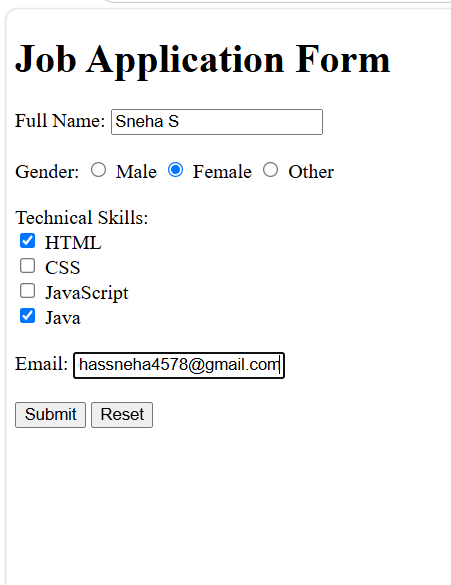

# 💼 Job Application Form

## 📖 Description

This is a simple **HTML Job Application Form** that includes:

- 👤 Full Name
- 🚻 Gender (Radio Buttons)
- 💻 Technical Skills (Checkboxes)
- 📧 Email
- ✅ Submit Button
- 🔄 Reset Button

## 🛠️ Technologies Used

- 🌐 HTML5

## 📸 Output

