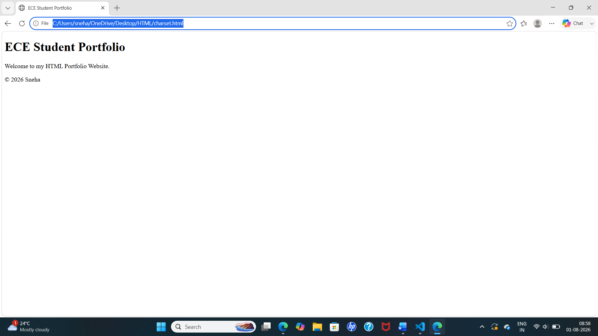

# HTML Portfolio Website

## Objective

Create a simple HTML Portfolio webpage using basic HTML structure and semantic tags.

---

## Files

- `index.html` – Main HTML file
- `output.png` – Screenshot of the webpage output

---

## HTML Code

```html
<!DOCTYPE html>
<html>
<head>
    <meta charset="UTF-8">
    <meta name="viewport" content="width=device-width, initial-scale=1.0">
    <meta name="description" content="HTML Portfolio Website">
    <meta name="keywords" content="HTML, Portfolio, ECE">
    <meta name="author" content="Sneha">

    <title>ECE Student Portfolio</title>
</head>

<body>

<header>
    <h1>ECE Student Portfolio</h1>
</header>

<section>
    <p>Welcome to my HTML Portfolio Website.</p>
</section>

<footer>
    <p>© 2026 Sneha</p>
</footer>

</body>
</html>
```

---

## Steps to Run

1. Save the code as `index.html`.
2. Open the file in any web browser.
3. The portfolio webpage will be displayed.

---

## Output Screenshot



---

## Features

- HTML5 document structure
- Semantic tags (`header`, `section`, `footer`)
- Responsive viewport meta tag
- SEO meta tags
- Simple portfolio layout

---


