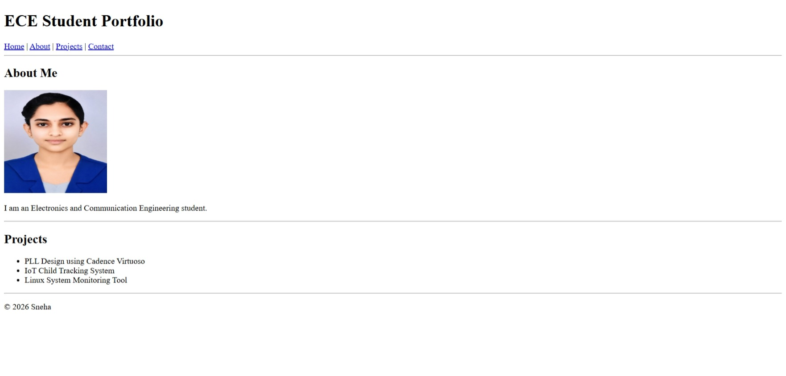

# HTML Best Practices

This repository contains a practice webpage created using HTML5 and HTML best practices.

## 📖 About

The webpage demonstrates:

- HTML5 document structure
- Semantic HTML elements
- Header, Navigation, Main, Sections, Articles, and Footer
- Images with alternative text
- Lists
- Internal navigation using anchor links
- Proper indentation and clean code

## 🛠 Technology Used

- HTML5

## 📂 Files

```
index.html
profile.jpg
output.png
README.md
```

## 📸 Output



## ▶️ How to Run

1. Download or clone this repository.
2. Open `index.html` in any web browser.

## 📚 Learning Topics

- HTML5 Basics
- Semantic Elements
- Images
- Lists
- Navigation
- Accessibility
- HTML Best Practices

## 👩‍🎓 Author

Sneha S

B.E. Electronics and Communication Engineering

## 📄 License

Created for learning and practice purposes.
