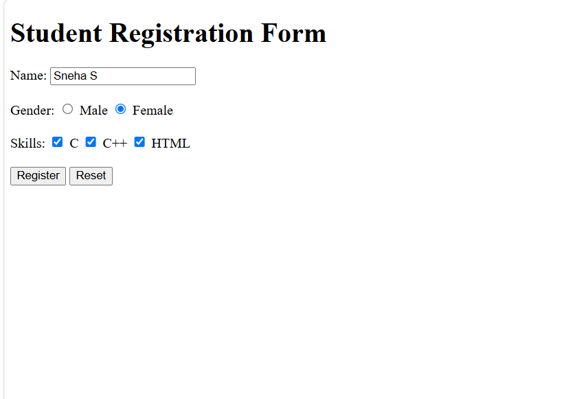

# HTML Day 6 - Radio Buttons and Checkboxes

## Objective
Learn how to create radio buttons, checkboxes, and a simple registration form using HTML.

## Source Code

```html
<!DOCTYPE html>
<html>
<head>
<title>Radio and Checkbox</title>
</head>
<body>

<h1>Student Registration Form</h1>

<form>

<label>Name:</label>
<input type="text" placeholder="Enter your name">

<br><br>

<label>Gender:</label>

<input type="radio" id="male" name="gender" value="Male" checked>
<label for="male">Male</label>

<input type="radio" id="female" name="gender" value="Female">
<label for="female">Female</label>

<br><br>

<label>Skills:</label>

<input type="checkbox" id="c" value="C">
<label for="c">C</label>

<input type="checkbox" id="cpp" value="C++">
<label for="cpp">C++</label>

<input type="checkbox" id="html" value="HTML">
<label for="html">HTML</label>

<br><br>

<input type="submit" value="Register">
<input type="reset">

</form>

</body>
</html>
```

## Output



## Concepts Learned

- Creating text input fields
- Creating radio buttons
- Grouping radio buttons using the `name` attribute
- Setting a default selected radio button using `checked`
- Creating checkboxes
- Creating Submit and Reset buttons
- Building a simple student registration form

