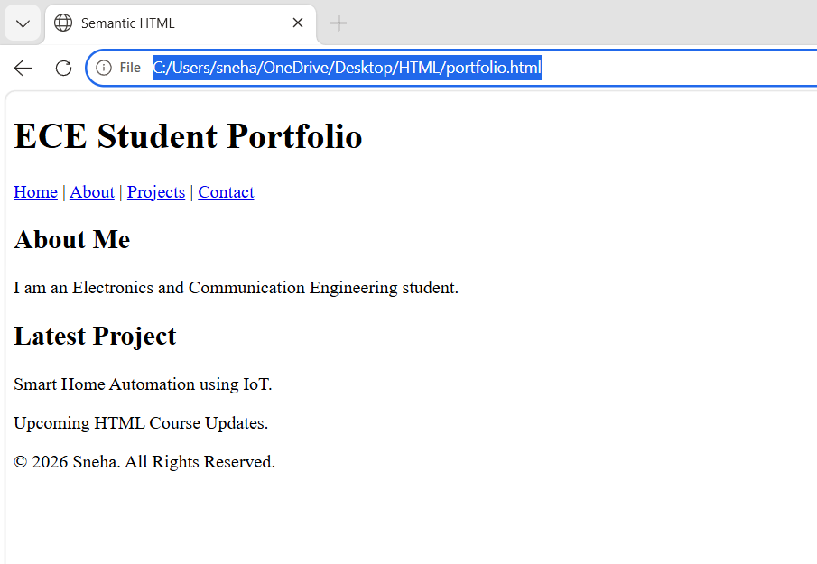

# Semantic HTML

## Aim
To understand and implement Semantic HTML5 elements.

## Description
This program demonstrates the use of Semantic HTML5 elements to create a well-structured web page. It includes a header, navigation bar, about section, article, aside, and footer.

## Semantic Elements Used
- `<header>`
- `<nav>`
- `<section>`
- `<article>`
- `<aside>`
- `<footer>`

## Technology Used
- HTML5

## File
- `index.html`

## Output

## Author
Sneha
