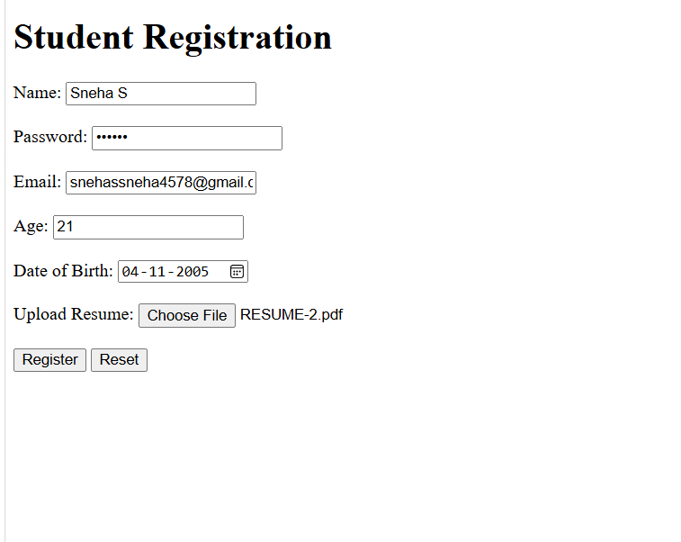

# Student Registration Form

## 📌Description
This project is a simple **Student Registration Form** created using **HTML**. It demonstrates the use of different HTML input types commonly used in web forms.

## 🚀 Features
- Text input (Name)
- Password input
- Email input
- Number input (Age)
- Date input (Date of Birth)
- File upload (Resume)
- Submit button
- Reset button
- Required field validation

## 🛠️ Technologies Used
- HTML5

## 📂 Project Files
```
StudentRegistration/
│── index.html
│── README.md
│── output.png
```

## 📖 HTML Input Types Used

| Input Type | Purpose |
|------------|---------|
| text | Enter student name |
| password | Enter password |
| email | Enter email address |
| number | Enter age |
| date | Select date of birth |
| file | Upload resume |
| submit | Submit the form |
| reset | Clear all fields |

## 📸 Output



## ▶️ How to Run
1. Download or clone the repository.
2. Open `index.html` in any web browser.
3. Fill in the form and test the input fields.

## 📚 Learning Outcomes
- Creating HTML forms
- Using different HTML input types
- Applying placeholders
- Using the `required` attribute
- Form submission and reset buttons

---


