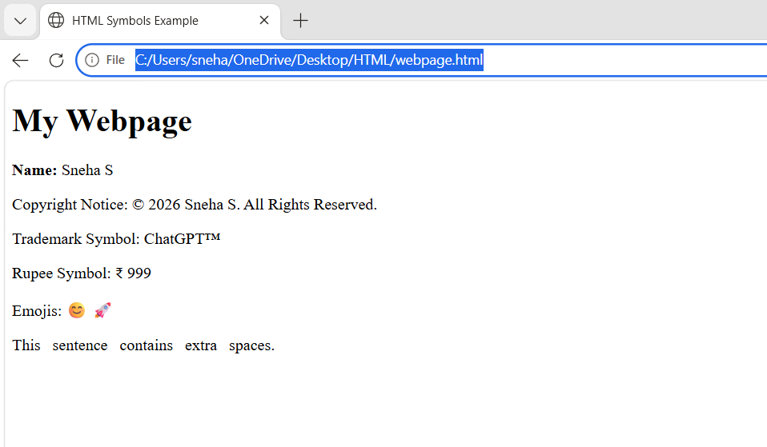

# HTML Entities

This HTML program demonstrates the use of HTML entities and special characters.

## Concepts Covered
- Displaying your name
- Copyright entity (`&copy;`)
- Trademark entity (`&trade;`)
- Rupee symbol (`&#8377;`)
- Emojis
- Non-breaking spaces (`&nbsp;`)

## Files
- `index.html` – HTML source code
- `output.png` – Screenshot of the output

## Output

